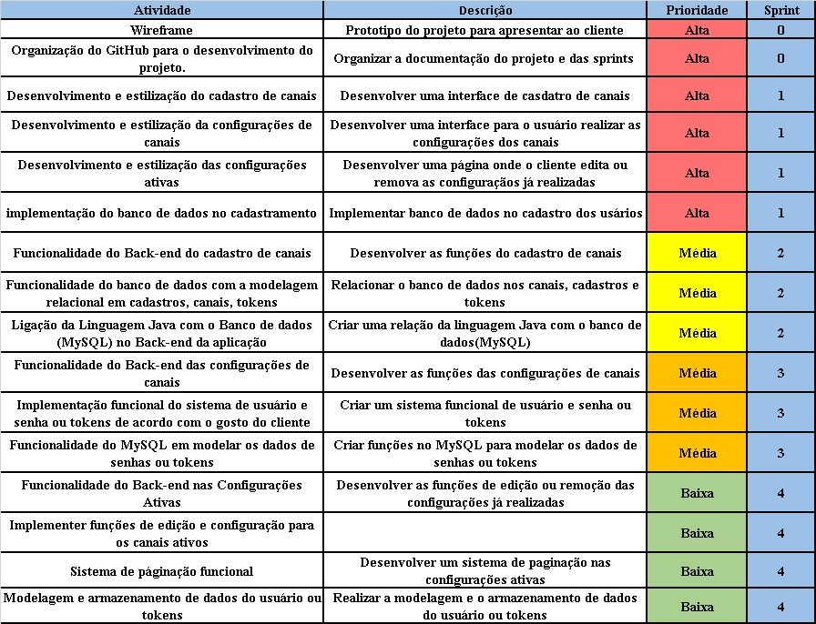

# API: 2º ADS - Little Tech

 

<h1> Aprendizado por Projeto Integrado do 2º semestre da Faculdade de Tecnologia de São José dos Campos - "Professor Jessen Vidal". </h1>

   

<h2> O Projeto 💼 </h2>

 Nossos clientes são vendedores de lojas online e físicas e para que possamos realizar nosso processo de conciliação financeira 
precisamos das informações destas vendas, para isso, estes clientes precisam realizar uma serie de configurações - nos dando autorização, 
para que nossos sistemas possam acessar: apis e planilhas de forma automatizada. Estas autorizações acontecem pela recepção de tokens e usuários de acesso. 
Portanto este sistema será responsável por salvar estas informações de usuário/senha e tokens. 

 

<h2>Objetivos 📌</h2>

 Desenvolver uma aplicação Java Desktop a fim de registrar canais de marketplaces, meios de pagamentos, plataformas, ERP com usuários, senhas ou tokens fornecidos pelo cliente, com o propósito da empresa parceira acessar as finanças da instituição cadastrada, no qual o aplicativo deverá apresentar um sistema de cadastramento com usuário e operador, e páginas para cadastrar canais, edita-los e gerencia-los.
 
  
 
<h3> Requisitos Funcionais: </h3>

 • Cadastro de canais (Marketpalces e Meios de Pagamentos) 

 • Configurações de canais (Aqui é onde o cliente realiza a configuração) 

 • Configurações Ativas (Utilizada para editar ou remover uma configuração) 

  

<h3> Requisitos Não Funcionais: </h3> 

 
 • Linguagem JAVA 

 
 • Banco de Dados Relacional MySQL 

 
 • Documentações 

  
  
<h2>Backlog 📊</h2> 
 O product backlog é uma lista ordenada que tem como função documentar de forma clara todos os requisitos do desenvolvimento de um projeto. Itens que precisem de maior refinamento geralmente têm uma importância menor e ficam mais abaixo no Product Backlog.  
 
 

 
 
 <h2>Equipe 👾</h2>
 
 Nome|Função|Github|Linkedin 
-----|------|------|---------
Brener Reis    |Product Owner|[@Github](https://github.com/BrenerReis)|[@Linkedin](https://www.linkedin.com/in/brener-freire-058950230/)
Eliezer Lopes  |Desenvolvedor|[@Github](https://github.com/EliezerLopes1)|[@Linkedin](LINK)
Gabriel Angelis|Desenvolvedor|[@Github](https://github.com/GabrAngelis)|[@Linkedin](https://www.linkedin.com/in/gabriel-luis-de-angelis-b64816237/)
Isabel Reis    |Desenvolvedor|[@Github](https://github.com/IsabelRReis)|[@Linkedin](https://www.linkedin.com/in/isabel-reis-09806920b/)
Mariana Veloso |Desenvolvedor |[@Github](https://github.com/Marih2210)|[@Linkedin](https://www.linkedin.com/in/mariana-veloso-979436231)
Nicolas Pereira|Desenvolvedor|[@Github](https://github.com/NicolasPereira06)|[@Linkedin](https://www.linkedin.com/in/nicolas-bonif%C3%A1cio-426804237/)
Rafaela Cabral |Scrum Master|[@Github](https://github.com/RafaelaCabral)|[@Linkedin](https://www.linkedin.com/in/rafaela-vieira-cabral-733b5922a)
Thyago Silveira|Desenvolvedor|[@Github](https://github.com/Thyaguixx)|[@Linkedin](https://www.linkedin.com/in/thyago-silveira-276984237/)

 
 
 
